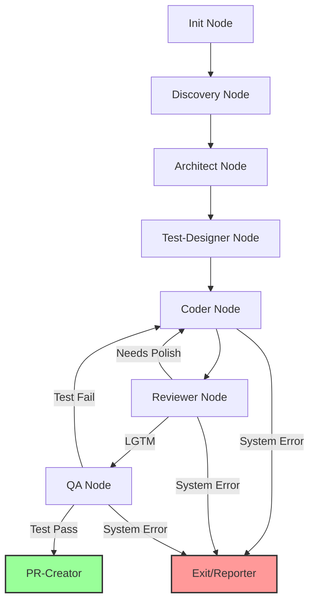

# Sentinel Healer (V2)

Sentinel Healer is an autonomous, repository-agnostic maintenance agent. It operates as a persistent daemon that monitors a project's `requirements.md` and implements features using a Test-Driven Development (TDD) cycle.

## 📡 System Architecture

The following diagram represents the core execution loop. This project is designed for "Inception-level" stability, ensuring the agent can maintain the framework without compromising the orchestration skeleton.

## 🛠️ Technical Stack
- **Language**: Python 3.12+
- **Orchestration**: LangGraph
- **Package Manager**: uv
- **Test Runner**: pytest (Mock-centric)
- **Primary LLMs**: 
    - Reasoning: Grok-4-Reasoning / o1
    - Fast: Grok-4-Non-Reasoning / GPT-4o

## 🧠 Agent Context (LTM)
<!-- AGENT_CONTEXT_START -->
- **Status**: Initialization Phase
- **Mode**: TDD Contract-First
- **Infrastructure**: Immutable main.py heartbeat and NodeFactory dependency injection.
- **Constraints**: 30s polling, surgical edits only, mandatory ingestion filtering.
<!-- AGENT_CONTEXT_END -->

---
*Note: This README is automatically updated by the Sentinel Healer agent. Do not remove the AGENT_CONTEXT blocks.*

